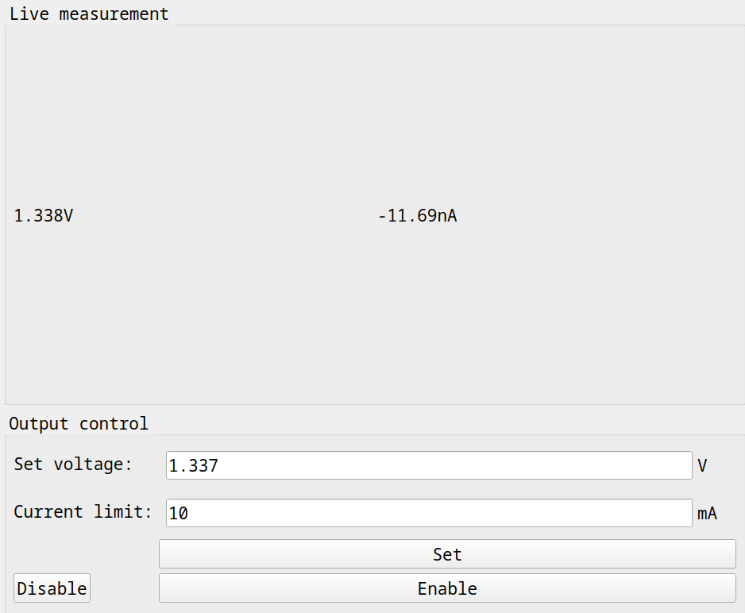

# uSMU software suite

## Installation

```shell
python -m venv .env
source .env/bin/activate
pip install -r requirements.txt
```

## Usage

There are two tools available- a command line tool for calibration, and a simple GUI for
measurements.

```shell
./usmu-cli.py --help
usage: usmu-cli.py [-h] [-d] port {identify,calibrate-current-offset,calibrate-vdac,calibrate-vadc,calibrate-ilim} ...

positional arguments:
  port                  Serial port

options:
  -h, --help            show this help message and exit
  -d, --debug

commands:
  {identify,calibrate-current-offset,calibrate-vdac,calibrate-vadc,calibrate-ilim}
    identify            Identify attached device
    calibrate-current-offset
                        Calibrate zero-current offset
    calibrate-vdac      Calibrate voltage output
    calibrate-vadc      Calibrate voltage measurement
    calibrate-ilim      Calibrate output current limit
```

```shell
./usmu-gui.py -h
usage: usmu-gui.py [-h] port

positional arguments:
  port

options:
  -h, --help  show this help message and exit
```


